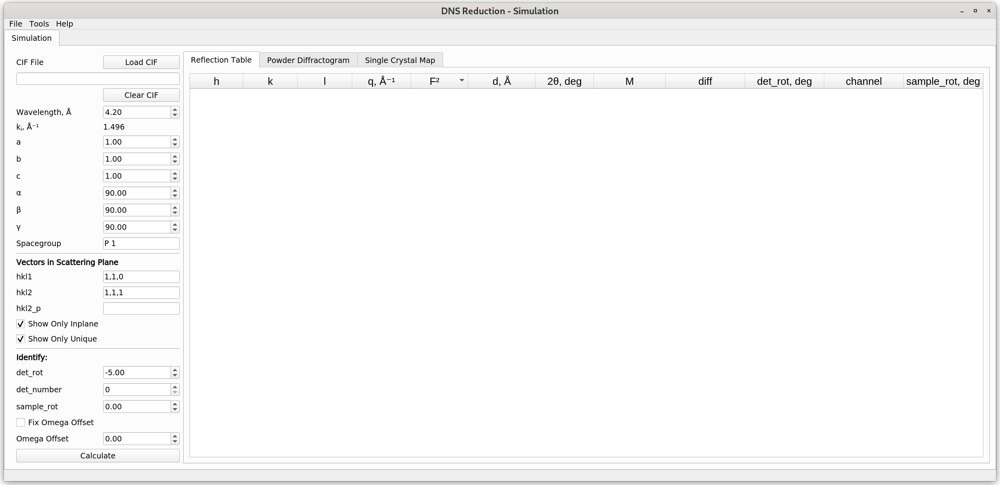

.. _dns_simulation-ref:

DNS Simulation
==============

Interface Overview
------------------

DNS Simulation mode is one of the data reduction modes of the "DNS Reduction"
interface. The latter can be accessed from the main menu of MantidWorkbench by
clicking on "Interfaces" → "Direct" and selecting the "DNS Reduction" option.
In order to switch to the DNS simulation mode, one should click on "Tools" →
"Change Mode" and select the "Simulation" option. The simulation mode enables
a user to generate a list of reflections, as well as to simulate a powder and
single crystal diffraction patterns for the DNS instrument.

Left Menu Overview
------------------

**Load CIF** button enables one to load a crystallographic file in a ``.cif``
format. If the loading was successful, then the filename, 6 lattice parameters
:math:`a, b, c, \alpha, \beta, \gamma` and the Spacegroup boxes will be updated.
The wavelength of a neutron beam has to be specified manually. The 6 lattice
parameters and the spacegroup can be set manually, too.

The **Clear CIF** button can be used to remove the loaded ``.cif`` file.

The **Vectors in Scattering Plane** groupbox contains input fields for
specifying vectors **hkl1** and **hkl2** in reciprocal space. These vertors will
be used to define the horizontal scattering plane. If the two vectors are not
perpendicular, a vector in the horizontal scattering plane that is perpendicular
to **hkl1** will be evaluated and displayed in the **hkl2_p** field after a user
has clicked the **Calculate** button. The tooltip of the input fields shows the
corresponding d-spacing.

The **Show Only Inplane** checkbox enables one to filter the generated list of
reflections and display only those reflections that happened exactly in the
horizontal scattering plane. The **Show Only Unique** checkbox enables one to
choose to display only unique reflections, based on the specified spacegroup.

The **Identify** groubox contains parameters that can be used to identify
specific reflections displayed in the **Reflection Table** after a user
has clicked the **Calculate** button. If **det_rot** and **det_number** are
provided, the possible identifications will be marked green
in the **Reflection Table**.

The **Calculate** button enables one to generate a list of reflections achievable
at DNS. These reflections will be displayed under the **Reflection Table** tab.

Tabs Usage and Description
--------------------------

* :ref:`Reflection Table <dns_simulation_reflection_table-ref>`
* :ref:`Powder Diffractogram <dns_simulation_powder_diffractogram_tab-ref>`
* :ref:`Single Crystal Map <dns_simulation_single_crystal_map-ref>`

.. categories:: Interfaces Direct
